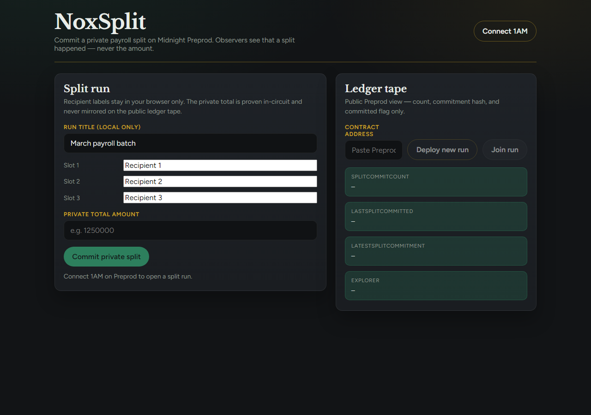
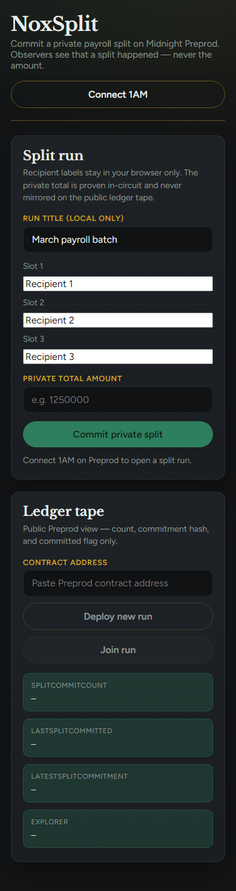
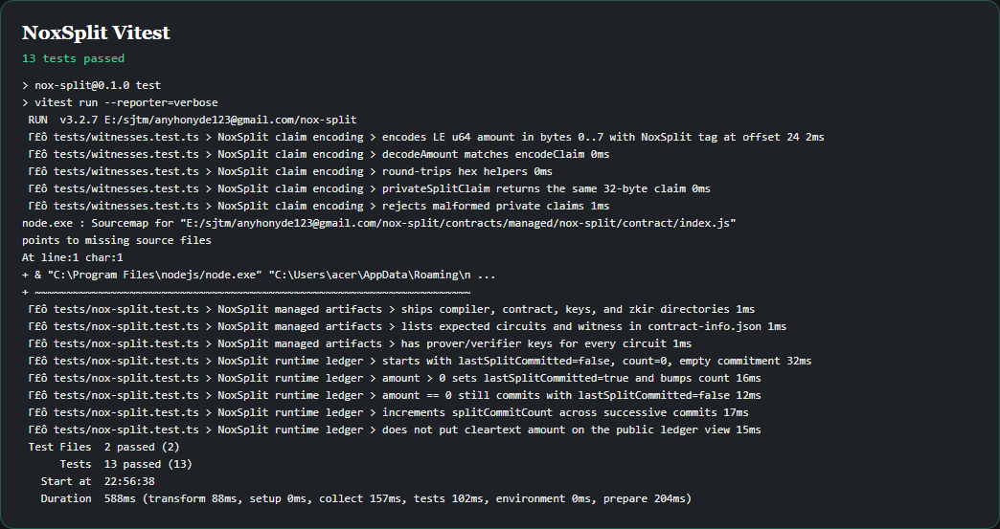
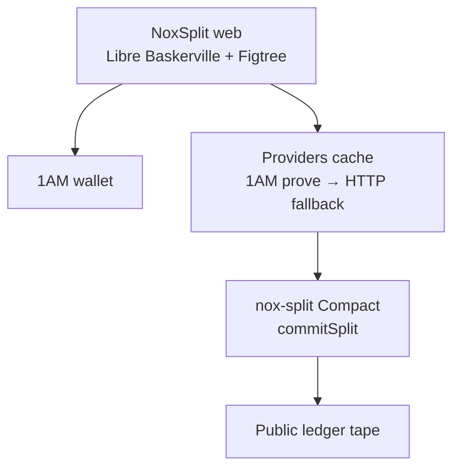
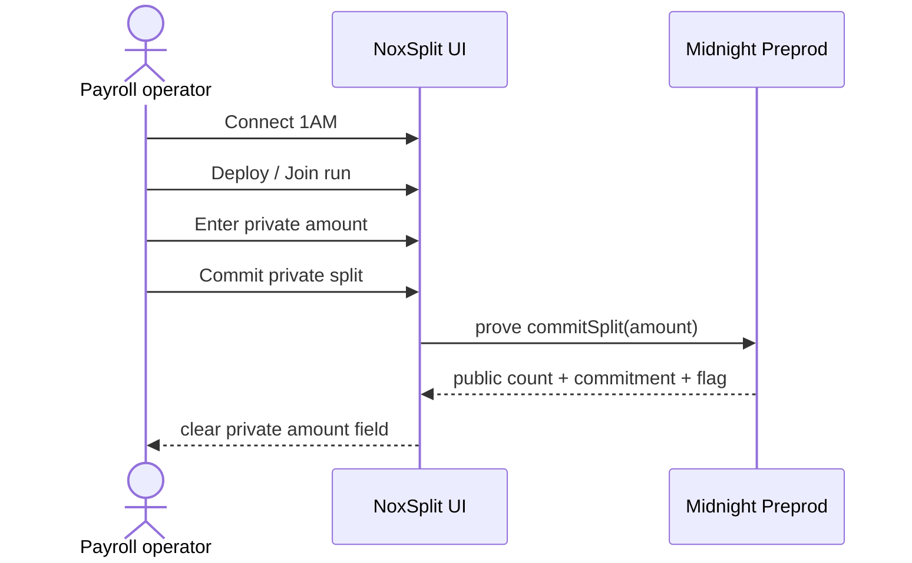

# NoxSplit

**Private payroll / splits on Midnight Preprod.**

[](https://github.com/OWNER/nox-split/actions/workflows/ci.yml)

> Replace `OWNER` in the badge URL with your GitHub org/user after the remote exists.

Commit a private payroll split without exposing amounts on the public ledger. Observers only see that a split was committed, how many commits exist, and a commitment hash.

| | |
|---|---|
| **Live demo** | _pending Vercel_ |
| **Network** | Midnight **Preprod** |
| **Wallet** | 1AM (primary) |
| **Contract** | see [docs/evidence/DEPLOYMENT.md](docs/evidence/DEPLOYMENT.md) |
| **Demo video** | see [docs/evidence/DEMO_VIDEO.md](docs/evidence/DEMO_VIDEO.md) |
| **Product proposal** | [docs/evidence/PRODUCT_PROPOSAL.md](docs/evidence/PRODUCT_PROPOSAL.md) |

---

## Levels overview

| Level | Focus | Status |
|---|---|---|
| L1 | Compact + basic dApp shell | ✅ absorbed into L2 |
| L2 | 1AM, commitSplit, Preprod, Vercel, privacy | ✅ |
| L3 | Tests ≥10, CI, evidence, mobile, proposal | ✅ |

---

## Level 2 checklist

| Requirement | Status |
|---|---|
| Midnight SDK + dapp-connector-api | ✅ |
| 1AM connect/disconnect, address, errors, loading | ✅ |
| `commitSplit` from UI with wallet/local proving | ✅ |
| Private amount never on public ledger tape; cleared after success | ✅ |
| Deploy + Join on Preprod | ✅ (UI path; record address in DEPLOYMENT.md) |
| Live Vercel demo | ✅ (after deploy step) |
| Preprod address in README + DEPLOYMENT.md | ✅ (placeholder until funded deploy) |
| README privacy model | ✅ |
| ≥8 meaningful commits | ✅ |
| Vitest ≥6 | ✅ (13) |

---

## Level 3 checklist

| Requirement | Status |
|---|---|
| ≥10 Vitest (prefer 13) | ✅ 13 |
| CI on main + badge | ✅ |
| Privacy core + observer table | ✅ |
| `docs/evidence/PRODUCT_PROPOSAL.md` | ✅ |
| Preprod-labeled address | ✅ |
| ≥10 commits | ✅ |
| Screenshots: desktop / mobile / tests | ✅ |
| DEMO_VIDEO.md + README placeholder | ✅ |
| Mobile ≤720px | ✅ |
| CODE_QUALITY.md | ✅ |
| README L1/L2/L3 tables | ✅ |

---

## Screenshots

| Desktop live | Mobile (~390) | Test results |
|---|---|---|
|  |  |  |

---

## Privacy — observer table

| Observer sees | Observer does **not** see |
|---|---|
| `splitCommitCount` | Private total amount |
| `latestSplitCommitment` (hash) | Recipient labels / slots |
| `lastSplitCommitted` (bool) | Per-recipient amounts |
| That a commit happened | Cleartext payroll payload |

Witness encoding: LE `u64` amount in bytes `0..7`; ASCII tag `NoxSplit` at offset `24`.

---

## Architecture





---

## CI

`.github/workflows/ci.yml`:

1. `npm ci`
2. `npm test`
3. `npm run web:sync-zk`
4. `npm --prefix web ci`
5. `npm --prefix web run build`

---

## Preprod deployment

| Field | Value |
|---|---|
| Network | **Preprod** |
| Contract | `PENDING_PREPROD_DEPLOY` — update after 1AM Deploy new run |
| Indexer | `https://indexer.preprod.midnight.network/api/v4/graphql` |
| Faucet | `https://faucet.preprod.midnight.network` |

Details: [docs/evidence/DEPLOYMENT.md](docs/evidence/DEPLOYMENT.md)

---

## Local setup

```bash
# Node ≥22
npm install
npm run compile:wsl   # or npm run compile on Linux/macOS with Compact 0.31.1
npm test
npm run web:sync-zk
npm --prefix web install
npm run web:dev
```

Optional proof server:

```bash
npm run proof-server
```

Deploy CLI (funded seed + proof server):

```bash
MIDNIGHT_SEED=<64-hex> npm run deploy:preprod
```

---

## License

MIT — see [LICENSE](LICENSE)
